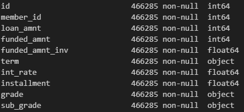
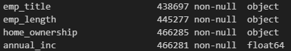
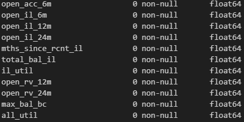
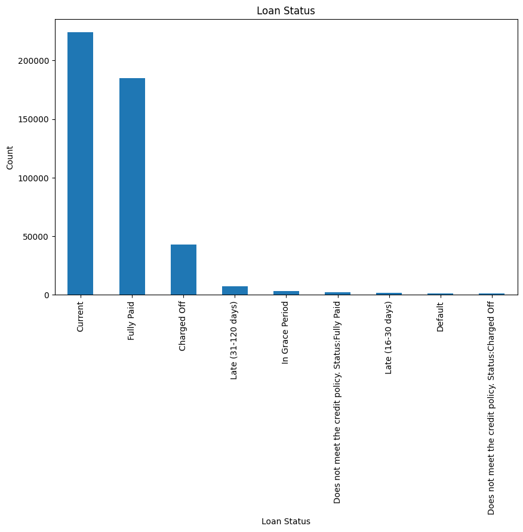
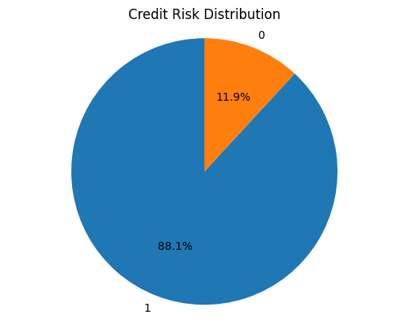
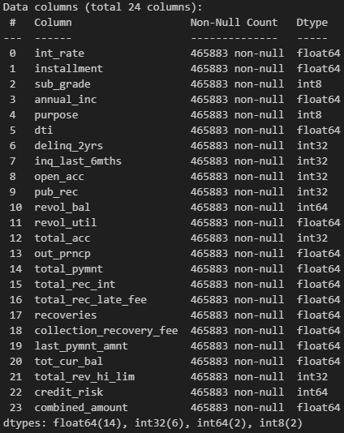
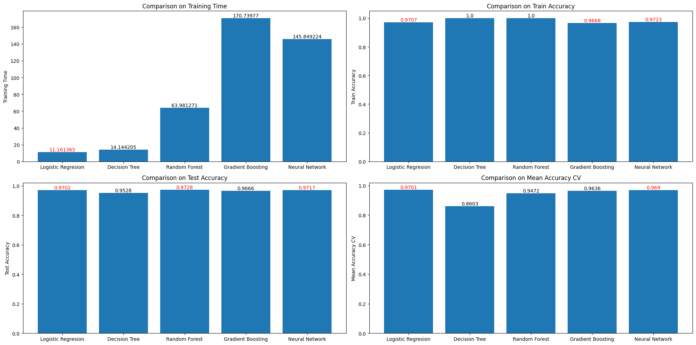
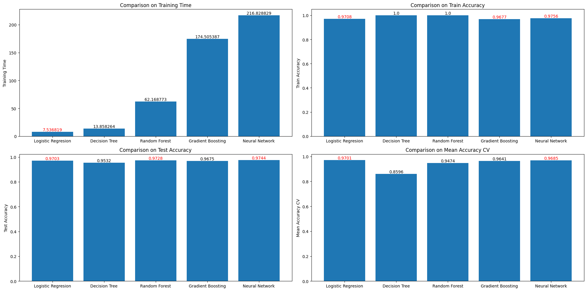
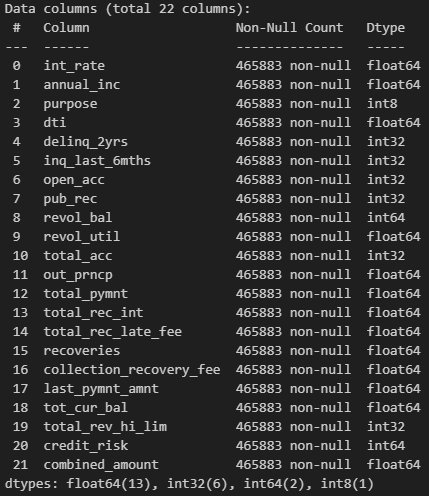
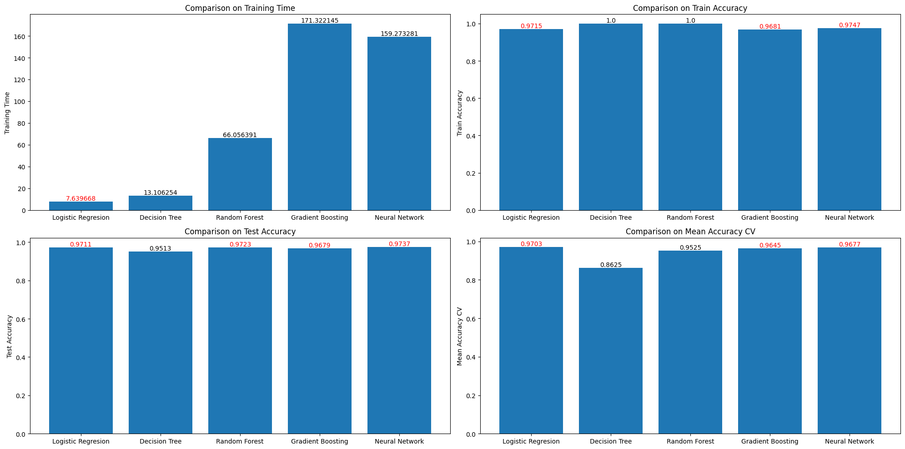

# Credit Risk Prediction
**Disclaimer: The dataset i used has been modified but just slightly different from above link.**

Using loan dataset, roughtly 240MB, you can get it here: https://www.kaggle.com/datasets/amiruddin09/loandataset. The purpose of this project is to make a predictive model to predict credit risk, whether it is good or bad.

## Data Understanding
The dataset has 466285 rows × 74 columns with float64(46), int64(6), object(22).

There are columns with no missing values.

Some have missing values.

Some are comepletely empty or no values at all.

One of the features is loan_status which later will be our target.

before we set it as target, we need to mapping out (encode) those values into numerical representation, 1 for good and 0 for bad.

## Modelling and Evaluation
Using 5 different model, i compare the training time, train accuracy, test accuracy, and mean accuracy on cross validation. Even tho it is little bit cheaty (i might say) because i set an early stopping on gradient boost and neural network but since it easy to set i'll let it be.

### **First Gen**
In this first try, I combined, dropped, imputed, encoded, and changed the data type of some features, Leaving as below.

and without using normalization, here is the result:

From charts above, we can conclude:
1. Logistic Regression has the fastest training time.
2. Decision Tree and Random Forest seem overfit on the training set.
3. Best 3 accuracy on test set are Logistic Regression, Random Forest, and Neural Network.
4. Logistic Regression have the most stable model as we can see on the mean accuracy on cross validation test.

**Logistic Regression** is the best model. Fastest training time yet get the highest mean accuracy on cross validation test, even without normalization on the dataset.

### **Second Gen**
Applying normalization on dataset before fed into the model.

From charts above, Neural Network model seems to have a better result and learn more from the data. But for overall result, there is **no significant increase on model performance**.

### **Third Gen**
Dropped 2 columns: installment and sub_grade, leaving as below.

and the result:

At this point, only Logistic Regression has slightly higher accuracy but longer training time.